# 🏗️ TRACE: Technical Architecture

> A deep-dive into the micro-component architecture powering intelligent academic assessment.

---

## 📋 Table of Contents
1. [Architecture Philosophy](#architecture-philosophy)
2. [System Overview](#system-overview)
3. [Layer-by-Layer Breakdown](#layer-by-layer-breakdown)
4. [Data Flow Pipeline](#data-flow-pipeline)
5. [API Specifications](#api-specifications)
6. [Database Schema](#database-schema)
7. [Security Considerations](#security-considerations)

---

## 🎯 Architecture Philosophy

### Why Micro-Components?

Traditional monolithic AI systems fail in education contexts because:

| Problem | Monolithic Approach | TRACE Approach |
|---------|--------------------|-----------------------|
| Debugging | "The AI broke" | "The Semantic Scorer returned low confidence" |
| Scalability | Rewrite everything | Swap GPT-4 for Claude in one config change |
| Demo Days | All-or-nothing | Demo Pattern Miner while Grading API recovers |
| Trust | Black box | Explainable at each stage |

### Design Principles

1. **Single Responsibility**: Each component does ONE thing well
2. **Loose Coupling**: Components communicate via standardized interfaces
3. **Fail-Safe Defaults**: Low confidence = Human review, not auto-pass
4. **Observability**: Every decision is logged and traceable

---

## 🗺️ System Overview

```
┌─────────────────────────────────────────────────────────────────────────────┐
│                              EXTERNAL INTERFACES                             │
│  ┌─────────────┐  ┌─────────────┐  ┌─────────────┐  ┌─────────────┐        │
│  │  Teacher    │  │  Student    │  │   Admin     │  │   LMS/SIS   │        │
│  │  Portal     │  │  Portal     │  │  Dashboard  │  │   Webhook   │        │
│  └──────┬──────┘  └──────┬──────┘  └──────┬──────┘  └──────┬──────┘        │
│         │                │                │                │                │
└─────────┼────────────────┼────────────────┼────────────────┼────────────────┘
          │                │                │                │
          ▼                ▼                ▼                ▼
┌─────────────────────────────────────────────────────────────────────────────┐
│                              API GATEWAY LAYER                               │
│  ┌─────────────────────────────────────────────────────────────────────┐   │
│  │  FastAPI Router │ JWT Auth │ Rate Limiting │ Request Validation     │   │
│  └─────────────────────────────────────────────────────────────────────┘   │
└─────────────────────────────────────────────────────────────────────────────┘
          │
          ▼
┌─────────────────────────────────────────────────────────────────────────────┐
│                           ORCHESTRATION LAYER                                │
│  ┌───────────────────┐  ┌───────────────────┐  ┌───────────────────┐       │
│  │  Celery Workers   │  │  Redis Queue      │  │  Event Bus        │       │
│  │  (Async Tasks)    │  │  (Task Broker)    │  │  (Pub/Sub)        │       │
│  └───────────────────┘  └───────────────────┘  └───────────────────┘       │
└─────────────────────────────────────────────────────────────────────────────┘
          │
          ▼
┌─────────────────────────────────────────────────────────────────────────────┐
│                           SERVICE MESH (5 LAYERS)                            │
│  ┌─────────────────────────────────────────────────────────────────────┐   │
│  │  Layer 1: Ingestion │ Layer 2: Grading │ Layer 3: Verification     │   │
│  │  Layer 4: Prediction │ Layer 5: Management                          │   │
│  └─────────────────────────────────────────────────────────────────────┘   │
└─────────────────────────────────────────────────────────────────────────────┘
          │
          ▼
┌─────────────────────────────────────────────────────────────────────────────┐
│                             DATA LAYER                                       │
│  ┌───────────────────┐  ┌───────────────────┐  ┌───────────────────┐       │
│  │  PostgreSQL       │  │  FAISS/ChromaDB   │  │  Redis Cache      │       │
│  │  (Structured)     │  │  (Vectors)        │  │  (Hot Data)       │       │
│  └───────────────────┘  └───────────────────┘  └───────────────────┘       │
└─────────────────────────────────────────────────────────────────────────────┘
```

---

## 🧩 Layer-by-Layer Breakdown

### Layer 1: Ingestion & Identity

> **Purpose**: Secure intake, identity extraction, and rubric standardization.

#### Component 1.1: Secure Document Gateway

```python
# Endpoint: POST /api/v1/documents/upload

class DocumentUploadRequest:
    file: UploadFile  # PDF/JPG, max 10MB
    exam_id: str
    teacher_id: str
    
class DocumentUploadResponse:
    batch_id: UUID
    status: "queued" | "processing" | "complete"
    estimated_time_seconds: int
```

**Implementation Details:**
- Validates MIME types (application/pdf, image/jpeg, image/png)
- Generates unique `batch_id` for tracking
- Stores raw files in S3-compatible storage (MinIO locally)
- Publishes `DocumentReceived` event to message queue

#### Component 1.2: Vision-Based ID Extractor

```python
class IDExtractor:
    def extract(self, image_path: str) -> StudentIdentification:
        """
        1. Pre-process image (deskew, contrast enhancement)
        2. Detect registration number region (header ROI)
        3. Apply OCR with confidence threshold
        4. Validate against student database
        """
        
class StudentIdentification:
    student_id: str
    confidence: float  # 0.0 - 1.0
    extraction_method: "ocr" | "barcode" | "qr"
    needs_manual_review: bool  # True if confidence < 0.85
```

**Tech Stack:**
- `pytesseract` for OCR
- `opencv-python` for image preprocessing
- Custom regex for registration number patterns

#### Component 1.3: Rubric Parser

```python
# Input (Natural Language):
"""
5 points for mentioning Newton's first law
3 points for correct formula
2 points for calculation (partial credit allowed)
Deduct 1 point for spelling errors
"""

# Output (Structured JSON):
{
    "rubric_id": "physics_midterm_q1",
    "total_points": 10,
    "criteria": [
        {
            "id": "c1",
            "description": "Mentions Newton's first law",
            "points": 5,
            "partial_credit": false
        },
        {
            "id": "c2", 
            "description": "Correct formula",
            "points": 3,
            "partial_credit": false
        },
        {
            "id": "c3",
            "description": "Correct calculation",
            "points": 2,
            "partial_credit": true
        }
    ],
    "deductions": [
        {
            "id": "d1",
            "description": "Spelling errors",
            "points": -1
        }
    ]
}
```

**Tech Stack:**
- GPT-4o-mini with structured output mode
- JSON schema validation via Pydantic

---

### Layer 2: Automated Grading & Assessment

> **Purpose**: Intelligent scoring with confidence quantification.

#### Component 2.1: Context-Aware Semantic Scorer

```python
class SemanticScorer:
    def grade(
        self,
        answer: str,
        rubric: RubricSchema,
        context: Optional[str] = None
    ) -> GradingResult:
        """
        System Prompt includes:
        1. Rubric criteria with point values
        2. Examples of full/partial credit
        3. Subject-specific context (if provided)
        
        Returns detailed breakdown per criterion.
        """

class GradingResult:
    total_score: float
    max_score: float
    criteria_scores: List[CriterionScore]
    deductions_applied: List[Deduction]
    reasoning: str  # For XAI
```

**Innovation: Partial Credit Logic**
```python
# Example reasoning trace:
"""
Criterion: Correct formula (3 points)
Student wrote: F = ma (correct)
→ Full credit: 3/3

Criterion: Correct calculation (2 points)  
Student wrote: F = 5 * 2 = 11 (arithmetic error)
→ Partial credit: 1/2 (formula correct, calculation wrong)
"""
```

#### Component 2.2: Confidence Quantifier

```python
class ConfidenceQuantifier:
    def quantify(
        self,
        grading_result: GradingResult,
        llm_response: LLMResponse
    ) -> ConfidenceScore:
        """
        Methods:
        1. Token probability analysis (logprobs)
        2. Self-consistency check (grade 3x, measure variance)
        3. Rubric coverage score (% criteria addressed)
        """

class ConfidenceScore:
    overall: float  # 0.0 - 1.0
    needs_review: bool  # True if < 0.7
    uncertainty_sources: List[str]
```

**Flagging Logic:**
| Confidence | Action |
|------------|--------|
| ≥ 0.9 | Auto-approve |
| 0.7 - 0.9 | Soft flag (teacher can batch approve) |
| < 0.7 | Hard flag (requires individual review) |

#### Component 2.3: Qualitative Feedback Generator

```python
class FeedbackGenerator:
    def generate(
        self,
        grading_result: GradingResult,
        student_history: Optional[StudentHistory] = None
    ) -> PersonalizedFeedback:
        """
        Considers:
        1. Current score and missed criteria
        2. Growth trajectory (improving vs declining)
        3. Learning style preferences (if available)
        """

class PersonalizedFeedback:
    summary: str  # 2-3 sentences
    strengths: List[str]
    improvements: List[str]
    next_steps: List[str]
    tone: "encouraging" | "constructive" | "celebratory"
```

---

### Layer 3: Grade Verification Pipeline

> **Purpose**: Statistical quality control before grade release.

#### Component 3.1: Temporal Anomaly Detector

```python
class TemporalAnomalyDetector:
    def detect(
        self,
        student_id: str,
        current_score: float,
        window_size: int = 5
    ) -> AnomalyResult:
        """
        Retrieves last N grades for student.
        Calculates Z-score: z = (x - μ) / σ
        Flags if |z| > 2.5
        """

class AnomalyResult:
    is_anomaly: bool
    z_score: float
    direction: "spike" | "drop" | "normal"
    historical_mean: float
    historical_std: float
```

**Alert Triggers:**
- Score **spike** (z > 2.5): Possible answer leak?
- Score **drop** (z < -2.5): Personal issues? Needs support

#### Component 3.2: Class Distribution Balancer

```python
class DistributionBalancer:
    def analyze(
        self,
        exam_id: str
    ) -> DistributionAnalysis:
        """
        Calculates:
        - Mean, Median, Mode
        - Standard Deviation
        - Skewness (asymmetry)
        - Kurtosis (tail heaviness)
        """

class DistributionAnalysis:
    skewness: float
    kurtosis: float
    is_healthy: bool
    alert_type: Optional["inflation" | "deflation" | "bimodal"]
    recommendation: str
```

**Alert Thresholds:**
| Metric | Healthy Range | Alert |
|--------|---------------|-------|
| Skewness | -1.0 to 1.0 | "Grade inflation" or "Harsh grading" |
| Kurtosis | -2.0 to 2.0 | "Unusual clustering" |

#### Component 3.3: Cross-Model Consistency Checker

```python
class ConsistencyChecker:
    def check(
        self,
        answer: str,
        rubric: RubricSchema
    ) -> ConsistencyResult:
        """
        Runs grading through:
        1. GPT-4o (primary)
        2. Claude 3 Opus (secondary)
        
        Compares results using diff algorithm.
        """

class ConsistencyResult:
    model_a_grade: float
    model_b_grade: float
    difference: float
    is_consistent: bool  # True if difference ≤ 10%
    conflict_resolution: Optional[str]
```

---

### Layer 4: Attendance & Predictive Analytics

> **Purpose**: From tracking to prediction.

#### Component 4.1: Pattern Miner

```python
class PatternMiner:
    def mine(
        self,
        student_id: str,
        date_range: DateRange
    ) -> List[AttendancePattern]:
        """
        Uses PrefixSpan algorithm to find sequential patterns.
        Examples:
        - "Absent Monday after long weekend" (95% confidence)
        - "Leaves early on Friday" (80% confidence)
        """

class AttendancePattern:
    pattern_type: str
    confidence: float
    occurrences: int
    sample_dates: List[date]
```

#### Component 4.2: Subject-Correlation Engine

```python
class CorrelationEngine:
    def analyze(
        self,
        student_id: str
    ) -> List[SubjectCorrelation]:
        """
        Calculates Pearson's r between:
        - Attendance % and Final Grade
        - Per subject basis
        """

class SubjectCorrelation:
    subject: str
    pearson_r: float
    p_value: float
    significance: "critical" | "moderate" | "low"
    
# Examples:
# Math: r=0.92 (Critical - every class matters)
# Art: r=0.15 (Low - flexible attendance OK)
```

#### Component 4.3: Dropout Risk Classifier

```python
class RiskClassifier:
    def predict(
        self,
        student_id: str
    ) -> RiskAssessment:
        """
        Logistic Regression model with features:
        - Current attendance rate
        - Current grade average
        - Attendance trend (improving/declining)
        - Days since last absence
        - Pattern miner flags
        """

class RiskAssessment:
    risk_level: "low" | "medium" | "high" | "critical"
    probability: float
    contributing_factors: List[str]
    recommended_actions: List[str]
```

**Model Features:**
| Feature | Weight | Description |
|---------|--------|-------------|
| `attendance_rate` | 0.35 | Current semester % |
| `grade_average` | 0.25 | Current GPA |
| `attendance_trend` | 0.20 | Slope of attendance over time |
| `days_since_absence` | 0.10 | Recency factor |
| `pattern_flags` | 0.10 | Binary flags from Pattern Miner |

---

### Layer 5: Integrated Management

> **Purpose**: Interface, communication, and intervention.

#### Component 5.1: Vector-Store Resource Recommender

```python
class ResourceRecommender:
    def recommend(
        self,
        failed_topics: List[str],
        student_profile: StudentProfile
    ) -> List[Resource]:
        """
        1. Embed failed topics using text-embedding-3-small
        2. Query FAISS for similar content
        3. Filter by difficulty level and format preference
        """

class Resource:
    title: str
    type: "video" | "pdf" | "quiz" | "article"
    url: str
    difficulty: "beginner" | "intermediate" | "advanced"
    relevance_score: float
```

#### Component 5.2: Sentiment-Driven Ticket Router

```python
class TicketRouter:
    def route(
        self,
        ticket: StudentTicket
    ) -> RoutingDecision:
        """
        1. Run VADER sentiment analysis
        2. Extract topic using NER
        3. Determine urgency
        4. Route to appropriate queue
        """

class RoutingDecision:
    sentiment: "positive" | "neutral" | "negative"
    urgency: "low" | "medium" | "high" | "critical"
    queue: "teacher" | "counselor" | "admin" | "technical"
    estimated_response_time: str
```

**Routing Matrix:**
| Sentiment | Topic | Route To |
|-----------|-------|----------|
| Negative + Academic | Grade dispute | Teacher Priority |
| Negative + Personal | Stress/anxiety | Counselor |
| Negative + Technical | Site broken | Tech Support |
| Neutral + Academic | Question about syllabus | Teacher Standard |

#### Component 5.3: Explainable AI Visualizer

```python
class XAIVisualizer:
    def explain(
        self,
        grading_result: GradingResult,
        answer_text: str
    ) -> Explanation:
        """
        Uses SHAP values or Attention Highlighting to show:
        - Which words/phrases contributed to score
        - Why deductions were applied
        """

class Explanation:
    highlighted_text: str  # HTML with spans
    feature_importance: List[FeatureContribution]
    natural_language_summary: str
```

---

## 🔄 Data Flow Pipeline

### Complete Lifecycle: Exam Upload → Grade Release

```mermaid
sequenceDiagram
    participant Teacher
    participant Gateway
    participant IDExtractor
    participant RubricParser
    participant Scorer
    participant Confidence
    participant Anomaly
    participant Distribution
    participant Consistency
    participant Dashboard

    Teacher->>Gateway: Upload exam PDF
    Gateway->>Gateway: Validate & store
    Gateway->>IDExtractor: Extract student ID
    IDExtractor->>Gateway: student_id + confidence
    
    alt ID Confidence < 0.85
        Gateway->>Teacher: Request manual ID entry
    end
    
    Gateway->>RubricParser: Parse rubric (if new)
    RubricParser->>Gateway: rubric_schema.json
    
    Gateway->>Scorer: Grade answer
    Scorer->>Confidence: Assess confidence
    Confidence->>Gateway: confidence_score
    
    alt Confidence < 0.7
        Gateway->>Dashboard: Flag for human review
    else Confidence ≥ 0.7
        Gateway->>Anomaly: Check temporal patterns
        Gateway->>Distribution: Analyze class spread
        
        alt Is Anomaly OR Bad Distribution
            Gateway->>Dashboard: Flag for review
        else All Checks Pass
            Gateway->>Consistency: Cross-model validation
            
            alt Models Disagree
                Gateway->>Dashboard: Require teacher decision
            else Models Agree
                Gateway->>Dashboard: Auto-approve grade
            end
        end
    end
    
    Dashboard->>Teacher: Display results
```



---

## 🗃️ Database Schema

### Core Tables

```sql
-- Students
CREATE TABLE students (
    id UUID PRIMARY KEY,
    registration_number VARCHAR(20) UNIQUE,
    name VARCHAR(100),
    email VARCHAR(100),
    enrollment_date DATE,
    current_semester INT
);

-- Exams
CREATE TABLE exams (
    id UUID PRIMARY KEY,
    course_id UUID REFERENCES courses(id),
    teacher_id UUID REFERENCES teachers(id),
    title VARCHAR(200),
    date DATE,
    rubric_json JSONB
);

-- Submissions
CREATE TABLE submissions (
    id UUID PRIMARY KEY,
    exam_id UUID REFERENCES exams(id),
    student_id UUID REFERENCES students(id),
    document_path VARCHAR(500),
    submitted_at TIMESTAMP,
    status VARCHAR(20) -- 'pending', 'grading', 'review', 'complete'
);

-- Grades
CREATE TABLE grades (
    id UUID PRIMARY KEY,
    submission_id UUID REFERENCES submissions(id),
    score DECIMAL(5,2),
    max_score DECIMAL(5,2),
    ai_confidence DECIMAL(3,2),
    reviewed_by UUID REFERENCES teachers(id) NULLABLE,
    criteria_breakdown JSONB,
    feedback TEXT,
    graded_at TIMESTAMP
);

-- Attendance
CREATE TABLE attendance (
    id UUID PRIMARY KEY,
    student_id UUID REFERENCES students(id),
    course_id UUID REFERENCES courses(id),
    date DATE,
    status VARCHAR(10), -- 'present', 'absent', 'late', 'excused'
    UNIQUE(student_id, course_id, date)
);

-- Risk Assessments
CREATE TABLE risk_assessments (
    id UUID PRIMARY KEY,
    student_id UUID REFERENCES students(id),
    assessed_at TIMESTAMP,
    risk_level VARCHAR(20),
    probability DECIMAL(3,2),
    factors JSONB,
    actions_recommended JSONB,
    actions_taken JSONB
);
```

---

## 🔒 Security Considerations

### Data Protection
- **PII Encryption**: Student names, emails encrypted at rest (AES-256)
- **Document Storage**: Exam files stored with server-side encryption
- **Access Control**: Role-based (Teacher, Admin, Student) with row-level security

### AI Safety
- **Prompt Injection**: Input sanitization before LLM calls
- **Output Validation**: Structured output with Pydantic validation
- **Rate Limiting**: Prevent abuse of grading endpoints

### Audit Trail
```sql
CREATE TABLE audit_log (
    id UUID PRIMARY KEY,
    timestamp TIMESTAMP,
    actor_id UUID,
    actor_type VARCHAR(20),
    action VARCHAR(50),
    resource_type VARCHAR(50),
    resource_id UUID,
    details JSONB
);
```

---

## 📊 Scalability Targets

| Metric | MVP | Production | Enterprise |
|--------|-----|------------|------------|
| Concurrent Users | 50 | 500 | 5,000 |
| Exams/Day | 100 | 10,000 | 100,000 |
| Grading Latency | 30s | 10s | 5s |
| Storage | 10GB | 1TB | Unlimited |

---

*Architecture Document v1.0 | TRACE Team*
